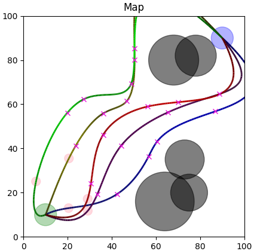
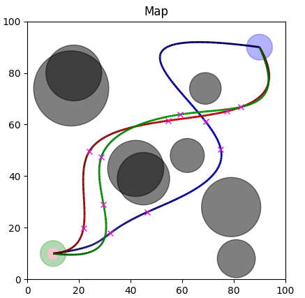
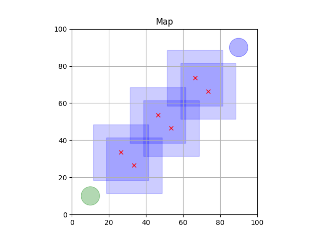
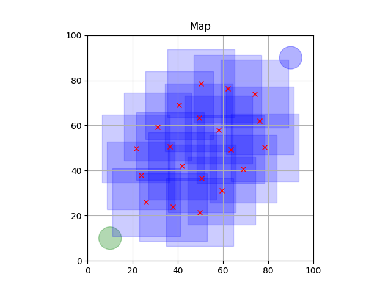
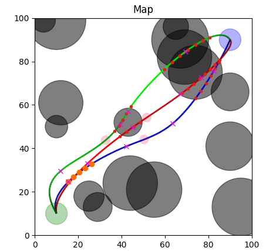

# Drone Swarm: Particle Swarm Optimization

This repository contains an experimental implementation of particle swarm optimization (PSO)
for coordinated multi-drone path planning in a 2D, obstacle-filled environment.
Each drone’s trajectory is represented by a cubic B-spline defined through a sequence of control
points; control points include x, y coordinates plus a local speed parameter. A particle encodes
a full set of control points for all drones, and the PSO searches this joint space to find
collision-free, time- and energy-efficient solutions from a common start to a common goal.

The project was developed as the practical component of an academic assignment in the
“Evolutionary Algorithms” course and focuses on reproducible experiments, configurable
algorithmic parameters (via .env.public), and visual analysis using matplotlib.

The system evaluates candidate solutions based on multiple goals:  
- Avoiding collisions between drones and obstacles,  
- Minimizing overall travel time,  
- Minimizing energy expenditure.  


## Table of Contents

- [Features](#features)
- [Setup](#setup)
  - [Dependencies](#dependencies)
  - [Configuration](#configuration)
- [Running](#running)
  - [Running a Deterministic Experiment](#deterministic)
- [Algorithmic Details](#algorithm)
  - [Solution Representation](#solution-representation)
  - [PSO Mechanics](#mechanics)
  - [Fitness](#fitness)
  - [Collision Detection](#collision-detection)
- [Visualization](#visualization)
- [Limitations](#limitations)


## <a name="features"></a>Features

- Multi-agent optimization: each particle encodes a full set of drone paths (each path is a
sequence of control points `x, y, v`)
- Smooth trajectories: cubic B-splines built from control points produce continuous position,
velocity and acceleration profiles
- Fitness that balances objectives: configurable weighted sum of time, energy and collisions
(obstacles and drones)
- Randomized environment generator with obstacles, optional traversability enforcement and a
map validator.
- Collision detection:
  - Drone-obstacle collisions: spatial sampling on splines.
  - Drone-drone collisions: time-synchronized sampling and pairwise checks.
- Deterministic experiments via seeds for reproducibility.
- CLI entrypoint and a matplotlib-based visualization to inspect trajectories and collisions.
- Configurable via .env.public





## <a name="setup"></a>Setup

First, it is recommended to install the application and all dependencies in
a Python 3.12+ environment:
```
python3 -m venv .venv
source .venv/bin/activate
```

The application is using a `pyproject.toml` and can be installed by running the following
command in the root directory `/EVO-HAW-SoSe25` containing the `pyproject.toml`:
```
pip install .
```
This will install the project like a regular package by building and copying all source
code files into `site-packages/`. All dependencies will be installed automatically. 
If the software is edited the application has to be built again using `pip install .`.

Note: The installation registers a CLI entry point (`droneswarm-pso`) if specified in the
`pyproject.toml` under `[project.scripts]`. The `-e` option installs an editable version,
creating a symbolic link (`.egg-link`) in your environment, allowing local code changes
to take effect immediately without reinstalling.


### <a name="dependencies"></a>Dependencies

The application uses the following libraries which will be installed automatically by
the `pyproject.toml`

```shell
- matplotlib==3.10.7
- networkx==3.4.2
- numpy==2.3.4
- pydantic_settings==2.12.0
- python-dotenv==1.2.1
- scipy==1.16.3
```


### <a name="configuration"></a>Configuration

Customize the `.env.public` file to match your desired runtime parameters:

```dotenv
DEBUG=False
SEED_ENVIRONMENT=-1# Seed for the randomizer of the environment generation -> -1 for no initial seed
SEED_PARTICLE=-1# Seed for the randomizer of the particle swarm optimization -> -1 for no initial seed

# DRONE PARAMETERS
NUMBER_DRONES=3# Number of drones in an environment
DRONE_RADIUS=2.0# Size of a drone
DRONE_MAX_SPEED=5.0# Maximum drone speed
INITIAL_CONTROL_POINTS=4# Number of points in a single drone path from start to goal

# ENVIRONMENT PARAMETERS
ENVIRONMENT_SIZE_X=100# Width of the environment
ENVIRONMENT_SIZE_Y=100# Height of the environment

ENVIRONMENT_TRAVERSABLE=False# Forces at least one path without any collisions from start to goal (NOTE: depending on environment size and number of obstacles, the calculation power needed can be exceedingly high.)
NUMBER_OBSTACLES=8# Number of obstacles in the environment
AVG_SIZE_OBSTACLE=10.0# Average size of all the obstacles

START_X=10# Starting point X-coordinate
START_Y=10# Starting point Y-coordinate
START_RADIUS=5# Starting point radius

GOAL_X=90# Goal point X-coordinate
GOAL_Y=90# Goal point Y-coordinate
GOAL_RADIUS=5# Goal point radius

# PARTICLE SWARM OPTIMIZATION PARAMETERS
PSO_PARTICLES=30# Number of particles to explore the solution space
PSO_ITERATIONS=100# Number of iterations the particle swarm optimization will perform

PSO_MAX_INITIAL_VELOCITY_X=10.0# Max velocity of particle (X) when initializing for the first time
PSO_MAX_INITIAL_VELOCITY_Y=10.0# Max velocity of particle (Y) when initializing for the first time
PSO_MAX_INITIAL_VELOCITY_DRONE_VELOCITY=1.3# Max drone velocity when initializing for the first time
PSO_INITIAL_POSITION_BOUNDS=30# Area around an initial point when generating in which the actual point generates for the first time
PSO_INITIAL_DISTANCE_PATHS=10# Probable distance between different drone paths when initializing for the first time

PSO_MAX_VELOCITY_X=15.0# Max velocity of a particle (X)
PSO_MAX_VELOCITY_Y=15.0# Max velocity of a particle (Y)
PSO_MAX_VELOCITY_DRONE_VELOCITY=2.0# Max velocity of a particle (drone velocity)
PSO_VELOCITY_DAMPING=0.5# Scalar which a particle is scaled with when violating environment bounds and bouncing back

PSO_FLUSH_SHARE=0.04# Portion of particles to be flushed each generation
PSO_FLUSH_WHEN=0.4# After how many generations will the flush occur for the first time (depending on the max number of iterations)

PSO_DECREASE_MAX_VELOCITY_WHEN=0.5# After how many generations will the max velocity begin to adapt (depending on the max number of iterations)
PSO_DECREASE_MAX_VELOCITY_GOAL=3.0# Max velocity value to gradually be approached through the generations
PSO_DECREASE_INITIAL_VELOCITY_WHEN=0.7# After how many generations will the initial velocity begin to adapt (depending on the max number of iterations)
PSO_DECREASE_INITIAL_VELOCITY_GOAL=1.5# Max initial velocity value to gradually be approached through the generations

PSO_WEIGHT_PERSONAL_POSITION=0.8# Weight the current personal position of a particle
PSO_WEIGHT_PERSONAL_BEST=0.7# Weight the current best personal position of a particle
PSO_WEIGHT_GLOBAL_BEST=0.1# Weight the current best global position of all particles

PSO_INCREASE_WEIGHT_GLOBAL_WHEN=0.8# After how many generations will the global weight begin to adapt (depending on the max number of iterations)
PSO_INCREASE_WEIGHT_GLOBAL_GOAL=0.9# Global weight value to gradually be approached through the generations
PSO_DECREASE_WEIGHT_PERSONAL_WHEN=0.75# After how many generations will the personal weight begin to adapt (depending on the max number of iterations)
PSO_DECREASE_WEIGHT_PERSONAL_GOAL=0.5# Personal weight value to gradually be approached through the generations

FITNESS_WEIGHT_ENERGY=0.5# How important is energy usage
FITNESS_WEIGHT_TIME=0.5# How important is time usage
FITNESS_WEIGHT_COLLISIONS_OBSTACLES=150.0# How important is obstacle collision prevention
FITNESS_WEIGHT_COLLISIONS_DRONES=30.0# How important is drone collision prevention
```
If the `.env.public` cannot be found the application will use default values.


## <a name="running"></a>Running

Use the CLI entry point to launch the application: 
```droneswarm-pso```
This command is registered automatically via the pyproject.toml under `[project.scripts]`.

The CLI entry point calls `cli_main()` which runs `async main()` and performs:
- environment generation
- PSO optimization
- plotting the final solution


### <a name="deterministic"></a>Running a Deterministic Experiment

To reproduce results exactly, set both seeds in .env.public:
- `SEED_PARTICLE` controls particle initialization & PSO randomness.
- `SEED_ENVIRONMENT` controls obstacle placement and environment randomness.

Then run the CLI. For reproducibility in parallel runs, ensure all other sources of
nondeterminism (e.g., threaded matplotlib backends, multiple RNG instances) are controlled.


## <a name="algorithm"></a>Algorithmic Details

This section explains the main algorithmic building blocks and points out important implementation
details and caveats.

### <a name="solution-representation"></a>Solution Representation

- A particle encodes `N` drone paths (one per drone).
- A drone path contains `M` control points: each control point is `(x, y, v)`
- Cubic B-splines (`CubicBSpline`) are used to turn control points into continuous `x(t)`, `y(t)` splines; timestamps are
derived from consecutive Euclidean distances divided by average velocities.


### <a name="mechanics"></a>PSO Mechanics

- Velocities and positions are updated per control point, treated as 3D vectors `(x, y, v)`.
- The algorithm maintains per-particle personal bests and a shared global best.
- Several schedule parameters adapt PSO behavior during the run (max velocity decay, weight adaptation, particle flush).
- A pattern of anchor points is calculated dynamically between start and goal using the number of drones and their
respective control points. Control points will be initialized randomly around their corresponding anchor points.
This is done under the assumption that a straight path from start to goal is statistically closer to an optimal solution
than a fully randomly generated path.





### <a name="fitness"></a>Fitness

calculate_fitness(...) sums weighted contributions:
- `time_usage` (sum of spline durations for all drones)
- `energy_usage` (numerical integral of `alpha * v + beta * a^2` sampled along spline)
- counts of collisions with obstacles and between drones
Weights are configurable (see `.env.public`).


### <a name="collision-detection"></a>Collision Detection

- Drone–obstacle: sample spline positions in space and test circle overlap with obstacle circle.
- Drone–drone: compute positions at synchronized time samples and test pairwise overlaps.


## <a name="visualization"></a>Visualization

The project uses matplotlib for visual diagnostics and time-series animations.

`plot_environment(environment)` draws:
- environment bounds and obstacles,
- start / goal,
- final spline trajectories for each drone,
- detected collision points if any,
- time animation.



- Orange dots: collisions between drones
- Red dots: collision between drones and obstacles
- Red transparent circles: drones
- Pink crosses: control points
- Colored splines: drone paths
- Black circles: obstacles


## <a name="limitations"></a>Limitations

- Simplified energy model. `calculate_energy_usage` uses a surrogate `alpha * v + beta * a^2`. It is not an
aero/battery-accurate energy model. For realistic aircraft/drone energy modeling you need aerodynamics, thrust-to-drag,
battery efficiency curves, and payload models.
- 2D only. The environment and splines are 2D. Extending to 3D is straightforward conceptually but requires more careful
collision checks and possibly different energy/time models.
- Static obstacles. No dynamic obstacles or moving agents are supported (but the framework can be extended).
- Scalability. As:
  - `NUMBER_DRONES`,
  - `INITIAL_CONTROL_POINTS`,
  - `NUMBER_OBSTACLES`,
  - `NUMBER_PARTICLES`
  grows, collision checks and particle calculations and therefore runtime grow exponentially.
- Single-objective fitness (weighted sum). Weighted sum merges multiple objectives into one scalar. This works but may
hide trade-offs.
- Singleton environment prevents multi-experiment parallelization within the same process.